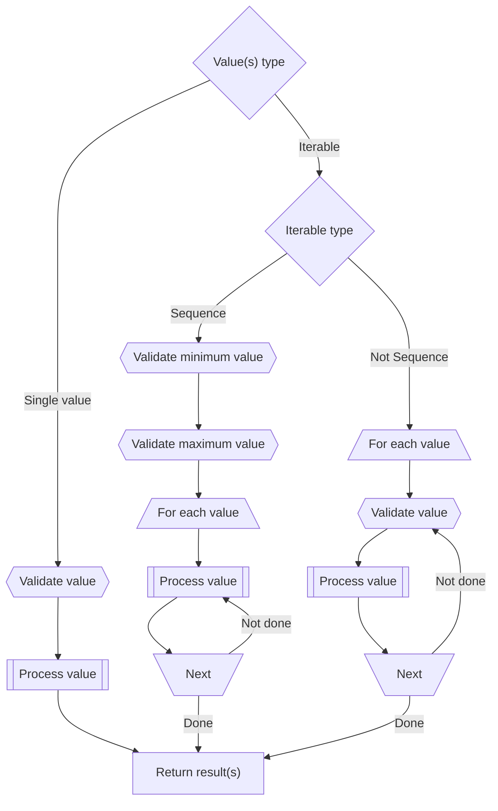

# Utility Package

**Copyright © 2024-2025 Dolphin Data Development Ltd. and AIDC Toolkit contributors**

Licensed under the Apache License, Version 2.0 (the "License"); you may not use this file except in compliance with the License. You may obtain a copy of the License at

https://www.apache.org/licenses/LICENSE-2.0

Unless required by applicable law or agreed to in writing, software distributed under the License is distributed on an "AS IS" BASIS, WITHOUT WARRANTIES OR CONDITIONS OF ANY KIND, either express or implied. See the License for the specific language governing permissions and limitations under the License.

## Overview

> [!WARNING]
> 
> **This software is in beta**, with production release is scheduled for 2025Q4. To follow the status of this and other projects, go to the AIDC Toolkit [projects](https://github.com/orgs/aidc-toolkit/projects) page.

The AIDC Toolkit `utility` package provides classes to manipulate integers and strings, independently of any AIDC problem domain. The package has been designed to maximize performance and minimize memory by reducing many of the typical AIDC requirements, such as serial number generation, to on-demand generation using the JavaScript [`Generator`](https://developer.mozilla.org/en-US/docs/Web/JavaScript/Reference/Global_Objects/Generator) type.

To provide the most flexibility and to handle the most significant demands of the AIDC problem domain, the AIDC Toolkit uses the JavaScript `bigint` type, with many functions converting from the lower-range `number` type if provided. This gives applications significant flexibility at a small performance cost inherent in `bigint` operations.

## Integers

### Sequence

Many of AIDC processes can be reduced to a simple statement about sequences:

* "Give me a million serial numbers for manufacturing."
* "Generate a handful of GTINs for my new product line."
* "Label the containers in the shipping area with SSCCs."

Each statement has a quantity and an output. Implicit in them is the requirement that the generated output be unique, not only within itself, but also within any previous outputs generated. A [`Sequence`](https://aidc-toolkit.com/api/Utility/classes/Sequence.html) is simply a utility to generate a sequence of integers given a start value and a count.

> [!TIP]
> 
> The AIDC Toolkit is not responsible for maintaining the history of any sequence. It is up to the application to ensure that the start value and count don't overlap with any other start value and count for a sequence used for the same purpose.

#### Creating and using a sequence

1. Create a sequence with a start value and a count. The count is typically positive, which means that the sequence runs from the start value up. If negative, the sequence runs from the start value down.
    ```typescript
    // Sequence starts at 33,000 and will iterate 1,000 times.
    const sequence = new Sequence(33000, 1000);
    ```
1. Use the sequence.
    * Use it in a for loop.
        ```typescript
        for (const value of sequence) {
            console.log(value);
        }
        ```
    * Transform it using an `Iterator` helper method.
        ```typescript
        const sum = Iterator.from(sequence).reduce((accumulator, value) => accumulator + value, 0);
        ```
    * Pass it to a function.
        ```typescript
        // Crate a sequence of 10-character hexadecimal strings.
        const stringSequence = HEXADECIMAL_STRING_CREATOR.create(10, sequence);
        ```

### Transformer

A transformer transforms values in a numeric domain to values in a range equal to the domain or to another range defined by a callback function.

There are two types of transformers defined in the AIDC Toolkit: the identity transformer and the encryption transformer. Regardless of the type, before any input value is transformed, it is validated against the domain provided when constructing the transformer; if the input value is less than zero or greater than or equal to the domain, an error is thrown.

The identity transformer simply maps any input value to itself as the output value.

The encryption transformer maps an input value to an output value resulting from repeated shuffle and xor operations defined by a tweak. In cryptography, a tweak is a value that alters an operation to change or "tweak" the output in a predictable and unique way that is hard to reverse engineer. Normally, a tweak works side by side with a password to generate a cryptographic key to ensure that no two systems can produce the same output from the same input and password; each system defines its own tweak and the password is kept by the user. Because the tweak is applied to every encryption operation, it is inherently less secure (e.g., a system administrator may know the tweak but that's not enough to compromise any user's encryption), but for the purposes of the AIDC Toolkit, it is secure enough.

Suppose that you're manufacturing a product that is valuable enough to be of interest to counterfeiters. To protect the product, you want to generate a unique serial number for each one you put on the market. If anyone submits a warranty claim, the serial number will tell you whether the product is legitimate.

You expect that you will manufacture at most 1,000,000 units of the product before releasing an upgrade, so your serial numbers are going to be numeric only and 6 digits long. If you generate the serial numbers in sequence, then generating 10 of them starting from unit 200,000 results in the following: 200000, 200001, 200002, 200003, 200004, 200005, 200006, 200007, 200008, 200009.

```typescript
// Transformer has a domain of 1,000,000; no tweak means that the identity transformer is used.
for (const value of Transformer.get(1000000).forward(new Sequence(200000, 10))) {
    console.log(value);
}
```

The sequence is predictable and a counterfeiter can easily guess at valid serial numbers, which will cause problems for distributors and retailers when they see duplicates in the supply chain, problems for your customers who believe they are buying a legitimate product, and problems for you when you can't easily distinguish legitimate from counterfeit.

The first thing you need to do is put some space between your serial numbers, to make guessing difficult. Let's say that in this case you make serial numbers 8 digits long, which means you have 100 times the capacity of serial numbers as of your expected manufacturing run. Next, you use the encryption transformer, with the tweak set to some random value (which you have to save and reuse to ensure that you don't generate any duplicates). Generating 10 serial numbers starting from unit 200,000 results in the following: 14608575, 00118914, 14609085, 00250498, 07625339, 85755635, 41179259, 67532896, 02000912, 19087354.

```typescript
// Transformer has a domain of 100,000,000; tweak means that the encryption transformer is used.
for (const value of Transformer.get(100000000, 8675309).forward(new Sequence(200000, 10))) {
    console.log(value);
}
```

The sequence is statistically random and a counterfeiter is highly unlikely to guess at valid serial numbers, which will make detection of illegitimate serial numbers significantly easier for all parties.

### Sequence and Transformer

The [`Transformer`](https://aidc-toolkit.com/api/Utility/classes/Transformer.html) class underlies most AIDC Toolkit operations involved in string creation. The [`forward()`](https://aidc-toolkit.com/api/Utility/classes/Transformer.html#forward) method takes either a single `number` or `bigint` value or an `Iterable<number | bigint>` of values. This provides maximum flexibility, but it comes at a cost. All inputs are validated prior to transformation, which can add to the system load when transforming a large number of values.

When dealing with `Iterable` inputs, transformers will recognize [`Sequence`](https://aidc-toolkit.com/api/Utility/classes/Sequence.html) objects and validate the start value and count at the beginning rather than each value individually as it is transformed. This reduces the number of validations from however many entries there are in an `Iterable` object to two. It also ensures that the client code deals with errors at the very beginning rather than in the middle of its processing.



## Strings

### String validation

Validation is a requirement for any application. The AIDC Toolkit provides a simple but extensible validation framework built on two interfaces: [`StringValidation`](https://aidc-toolkit.com/api/Utility/interfaces/StringValidation.html) and [`StringValidator`](https://aidc-toolkit.com/api/Utility/interfaces/StringValidator.html). The two are related in that an interface extending `StringValidation` may be passed as a parameter to the [`validate()`](https://aidc-toolkit.com/api/Utility/interfaces/StringValidator#validate.html) method of a class implementing `StringValidator` to restrict validation further than the default. For example, [`CharacterSetValidator`](https://aidc-toolkit.com/api/Utility/classes/CharacterSetValidator.html) accepts a [`CharacterSetValidation`](https://aidc-toolkit.com/api/Utility/interfaces/CharacterSetValidation.html) object that can constrain the length and limit the way numeric values are expressed (e.g., exclude zero as the first character or exclude strings that are all numeric).

The `StringValidation` interface is a placeholder only; it's empty, which, in a structurally typed language like TypeScript, matches any object, so it's up to `StringValidator` implementations to decide what the implementation type should be.

If a string passed to a `validate()` method is valid, the method returns; if not, a [`RangeError`](https://developer.mozilla.org/en-US/docs/Web/JavaScript/Reference/Global_Objects/RangeError) is thrown.

#### Predefined validators

The following validator types are predefined:

* [Regular expression](https://aidc-toolkit.com/api/Utility/classes/RegExpValidator.html)
    * Validates a string against a [regular expression](https://developer.mozilla.org/en-US/docs/Web/JavaScript/Guide/Regular_expressions).
* [Record](https://aidc-toolkit.com/api/Utility/classes/RecordValidator.html)
    * Validates a string by looking it up in a [`Record`](https://www.typescriptlang.org/docs/handbook/utility-types.html#recordkeys-type) object.
* [Character set](https://aidc-toolkit.com/api/Utility/classes/CharacterSetValidator.html)
    * Validates a string by ensuring that each character is within a defined character set, with additional validation parameters optionally constraining the length and limiting the way numeric values are expressed. Predefined character set validators are:
        * [Numeric (0-9)](https://aidc-toolkit.com/api/Utility/variables/NUMERIC_VALIDATOR.html)
        * [Hexadecimal (0-9, A-F)](https://aidc-toolkit.com/api/Utility/variables/HEXADECIMAL_VALIDATOR.html)
        * [Alphabetic (A-Z)](https://aidc-toolkit.com/api/Utility/variables/ALPHABETIC_VALIDATOR.html)
        * [Alphanumeric (0-9, A-Z)](https://aidc-toolkit.com/api/Utility/variables/ALPHANUMERIC_VALIDATOR.html)

### String creation

String creation varies depending on the type of string being created, so there's no single interface that can be implemented. There is a pattern, however:

* Creation is done via a `create()` method. If the class can create more than one type of string, it can define additional `create*NNN*()` methods as appropriate.
* The `create()` (or `create*NNN*()`) method is overloaded, with a parameter accepting either a single value to create a single string or multiple values (as `Iterable`) to create multiple strings.
* If the value to create a string is numeric (`number` or `bigint`), the method uses a [`Transformer`](https://aidc-toolkit.com/api/Utility/classes/Transformer.html) and supports sparse creation.
    * Because of this, passing in a [`Sequence`](https://aidc-toolkit.com/api/Utility/classes/Sequence.html) is strongly recommended when creating multiple strings.

#### Predefined creators

The following creator types are predefined:

* [Character set](https://aidc-toolkit.com/api/Utility/classes/CharacterSetCreator.html)
    * Creates strings by mapping numeric (`number` and `bigint`) values to fixed-length string representations using the character set as the "digits" of the string. Predefined character set creators are:
        * [Numeric (0-9)](https://aidc-toolkit.com/api/Utility/variables/NUMERIC_CREATOR.html)
        * [Hexadecimal (0-9, A-F)](https://aidc-toolkit.com/api/Utility/variables/HEXADECIMAL_CREATOR.html)
        * [Alphabetic (A-Z)](https://aidc-toolkit.com/api/Utility/variables/ALPHABETIC_CREATOR.html)
        * [Alphanumeric (0-9, A-Z)](https://aidc-toolkit.com/api/Utility/variables/ALPHANUMERIC_CREATOR.html)

#### Output restriction

As with string validators, string creators can restrict their output to meet the needs of certain use cases. For example, when creating serial numbers, it may be necessary to generate values that either don't start with a zero (to prevent leading zeros from being dropped by other applications) or that aren't composed entirely of digits (to prevent strings from being interpreted as numbers).
